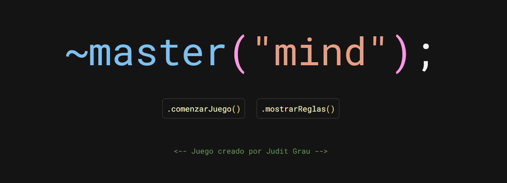
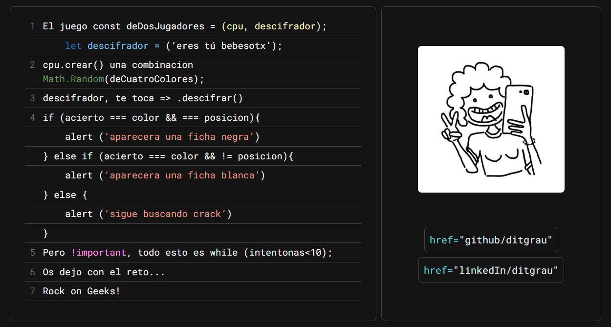
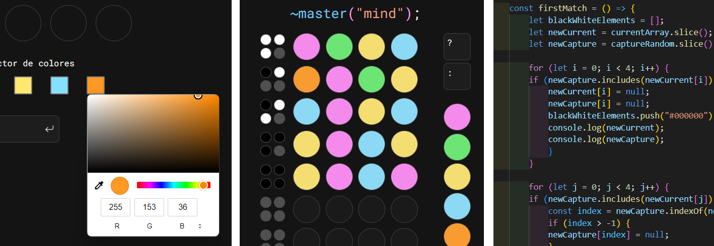

__
Proyecto 3 - Mastermind - Semana 4
__
<h2 align="center">👩🏻‍💻 Primer proyecto con JavaScript 👩🏻‍💻</h2>

Implementación en JavaScript del juego Mastermind, como parte del Bootcamp de Full Stack Developer de Geekshubs Academy.

### Inspiración.

En este proyecto, me he inspirado en la imagen y el estilo de escritura que utilizamos para programar en JavaScript con Visual Studio Code (VSC). Últimamente, esto ha ocupado la mayor parte de mi tiempo, siendo prácticamente todo en lo que pienso e incluso lo que sueño. Por lo tanto, no me resultó difícil adaptar el juego Mastermind a la apariencia visual de VSC.

### Desarrollo.
El proyecto ha sido desarrollado y diseñado en su totalidad por mí, utilizando HTML5, CSS3 y JavaScript. Además, se ha incorporado Bootstrap 5 para garantizar la funcionalidad responsive del proyecto. Aunque se ha adaptado para su visualización en dispositivos móviles, <b>el enfoque principal del diseño se ha centrado en la versión de escritorio. </b>
 

##### ⚙️ Dificultades encontradas.
A pesar de que este proyecto ha sido un desafío tanto a nivel técnico como psicológico, el resultado es satisfactorio. Sin embargo, he enfrentado dificultades significativas, siendo las siguientes las más destacadas:

🔸 El color picker presentó desafíos debido a la obtención de los datos en formato hexadecimal y la dificultad para encontrar una forma de realizar las comparaciones en formato RGB. 
🔸 La funcionalidad de las comparaciones de los arrays para determinar la cantidad exacta de bolas blancas y negras también fue complicada. 
🔸 Y, en general, traducir mis ideas al lenguaje JavaScript con mis limitados conocimientos y experiencia ha sido un desafío. 
A través de este proyecto, he adquirido una gran cantidad de aprendizajes, siendo el primero darme cuenta de que soy más persuasiva de lo que creía.

### Menciones.
Por supuesto a los profesores de Geekshubs, agradecida por el conocimiento que comparten con nosotros.  
A mis compañeros del bootcamp, sobretodo a la primera fila, pero en particular a Coral y a Hector por su generosidad y apoyo. 

💎 https://github.com/Coral-JM 
💎 https://github.com/hmateu

